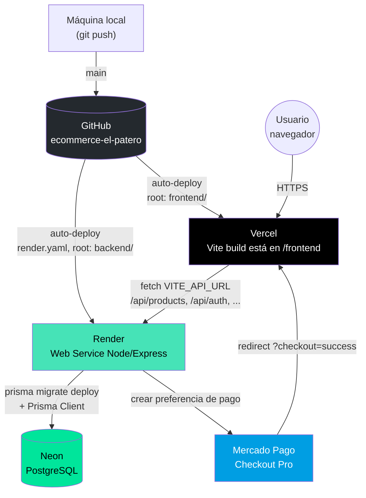

# El Patero GrowShop — Arquitectura y Deploy

Documento de referencia del stack real en producción y de cómo se llegó hasta acá.
Reemplaza al viejo `frontend/src/DEPLOYMENT.md`, que describía una arquitectura
(Supabase + Next.js) que nunca se usó — la real es Express + Prisma + Neon.

## Stack

| Capa | Tecnología | Dónde vive |
|---|---|---|
| Frontend | React + TypeScript + Vite | [Vercel](https://vercel.com) |
| Backend | Express (Node) | [Render](https://render.com) |
| Base de datos | PostgreSQL | [Neon](https://neon.tech) |
| ORM | Prisma | — |
| Pagos | Mercado Pago (Checkout Pro) | — |
| Auth | JWT propio (bcrypt + jsonwebtoken) | — |
| Repo | GitHub, monorepo (`frontend/` + `backend/`) | `enriquezleandro/ecommerce-el-patero` (privado) |

## Diagrama de arquitectura



**Flujo de un request típico:** el navegador carga la SPA estática desde Vercel;
esa SPA le pega directo al backend en Render (`VITE_API_URL`) para todo lo
dinámico (productos, login, pedidos, reviews); el backend habla con Neon vía
Prisma. El único salto a un tercero externo es Mercado Pago, al momento de
crear la preferencia de pago en el checkout.

## Roadmap — qué se hizo y en qué orden

1. **Base de datos (Neon) + Prisma** — ya existía antes de este roadmap:
   schema con `Product`/`Review`, migración inicial, seed con 16 productos.
2. **Versionado**: `git init` en la raíz (antes no había ni un commit),
   `.gitignore` cubriendo `node_modules/`, `.env*`, `dist/`/`build/`.
   Repo creado en GitHub bajo la cuenta personal (`enriquezleandro`), privado.
3. **Deploy del backend en Render**: `render.yaml` (Blueprint) con
   `rootDir: backend`, `startCommand: npx prisma migrate deploy && node server.js`,
   plan Free. Variables sensibles (`DATABASE_URL`, `DIRECT_URL`,
   `MP_ACCESS_TOKEN`, `JWT_SECRET`, `FRONTEND_URL`, `CORS_ORIGIN`) cargadas a
   mano en el dashboard de Render, nunca committeadas.
4. **Deploy del frontend en Vercel**: import del repo, `Root Directory: frontend`,
   preset Vite, `Output Directory` override a `build` (el proyecto no usa el
   `dist` default), env var `VITE_API_URL` apuntando al backend de Render.
5. **CORS**: una vez que el frontend tuvo su dominio de Vercel, se actualizó
   `FRONTEND_URL`/`CORS_ORIGIN` en Render (antes apuntaban a `localhost:3000`).
6. **Auth real**: modelos `User`/`Order` en Prisma, JWT (`jsonwebtoken` +
   `bcryptjs`), endpoints `/api/auth/register|login|me`. Se reemplazó el
   `AuthContext` mockeado del frontend (usuarios hardcodeados, `localStorage`)
   por llamadas reales al backend.
7. **Pedidos reales**: `POST/GET /api/orders`. El checkout crea el pedido de
   verdad tanto en el flujo simulado con tarjeta como al volver de Mercado
   Pago con `?checkout=success`.
8. **Reviews reales**: `POST /api/products/:id/reviews`, con recálculo
   automático del `rating` promedio del producto.
9. **Rol admin**: `User.isAdmin`. Antes de esto, crear/editar/borrar
   productos era público (cualquiera con la URL podía vaciar el catálogo).
   Ahora esas rutas exigen estar logueado **y** tener `isAdmin: true`.

## Pendiente

- **Webhook de Mercado Pago**: hoy el pedido se guarda cuando MP redirige con
  `?checkout=success`, sin confirmación server-to-server. Falta el endpoint
  que reciba la notificación de pago de MP y marque el pedido como pagado de
  verdad. Bloqueado por ahora: se está esperando acceso a las credenciales de
  prueba (`TEST-...`) de la cuenta de Mercado Pago usada.
- Reactivar `auto_return` en la preferencia de pago (se desactivó porque
  `FRONTEND_URL` era `localhost`; ya no debería hacer falta).
- No hay panel de administración en el frontend — crear/editar productos por
  ahora solo se puede hacer pegándole directo a la API con un token de admin.
- El botón "Ver Detalles" de un pedido en el perfil no tiene vista asociada.
- No hay forma de cambiar el estado de un pedido (`pending → shipped → ...`).

## Variables de entorno

Ninguna de estas se commitea — viven en `backend/.env` (local) y en el
dashboard de Render/Vercel (producción). Ver `backend/.env.example` y
`frontend/.env.example` para la lista completa con comentarios.

**Backend (Render):** `DATABASE_URL`, `DIRECT_URL`, `MP_ACCESS_TOKEN`,
`JWT_SECRET`, `FRONTEND_URL`, `CORS_ORIGIN`.

**Frontend (Vercel):** `VITE_API_URL`.

## Desarrollo local

```bash
# Backend
cd backend
npm install
npm run dev        # node --watch server.js, puerto 4000

# Frontend (otra terminal)
cd frontend
npm install
npm run dev         # vite, puerto 3000
```

## Cómo se dispara un deploy nuevo

Tanto Render como Vercel tienen auto-deploy activado sobre la rama `main`:
un `git push` a `main` dispara build + deploy en los dos servicios en
paralelo, sin pasos manuales. Si Render necesita una migración de Prisma
nueva, se aplica sola como parte del `startCommand` (`prisma migrate deploy`).
